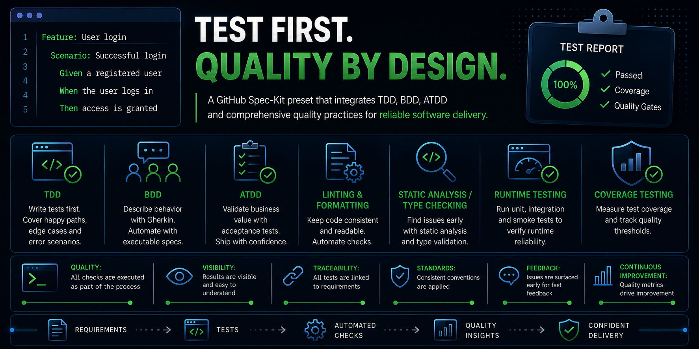

# Test-First Governance Preset for GitHub Spec Kit

## Motivation

Spec-Driven Development makes intent explicit before implementation, but a specification alone does not prove that the resulting software is correct, resilient, or complete. This preset strengthens the path from specification to implementation with test-first executable evidence, requirement-to-test traceability, and risk-based quality gates.

The goal is a robust and repeatable delivery workflow in which expected failures are observed before production changes, requirements remain connected to current evidence, and completion depends on declared tests and quality checks passing.

## Approach

The preset strengthens the existing [GitHub Spec Kit](https://github.com/github/spec-kit) workflow rather than replacing it:

- **Test-Driven Development (TDD)** applies incremental Red-Green-Refactor cycles to production logic.
- **Behavior-Driven Development (BDD)** expresses applicable user-visible behavior and business rules as executable Gherkin examples.
- **Acceptance Test-Driven Development (ATDD)** defines executable stakeholder-facing acceptance evidence before implementation.
- **Traceability** connects stories, requirements, edge cases, scenarios, tests, and current execution evidence.
- **Risk-based quality gates** apply coverage, linting, formatting, static analysis, security, and runtime checks according to the project's stack and risk surface.

## Requirements and Installation

This preset requires GitHub Spec Kit `>=0.8.0`. It governs generated artifacts and agent instructions; it does not install the test runners or analysis tools selected during planning.

After a release tag is published, install it directly with:

```bash
specify preset add --from "https://github.com/ka-zo/spec-kit-preset-test-first-governance/archive/refs/tags/<release-tag>.zip" --priority 5
```

If the preset is available in your configured catalog:

```bash
specify preset add test-first-governance --priority 5
```

Priority `5` allows the preset's mandatory test-first rules to supersede lower-priority optional-test wording while remaining composable with other presets.

## Recommended Workflow

```text
/speckit.constitution
/speckit.specify
/speckit.clarify
/speckit.plan
/speckit.checklist
/speckit.tasks
/speckit.analyze
/speckit.implement
/speckit.converge
```

This preset strengthens `constitution`, `specify`, `plan`, `checklist`, `tasks`, `analyze`, and `implement`. It does not modify `clarify` or `converge`; `clarify` is an optional but recommended step before planning.

## Governance Scope

- **TDD** is mandatory for production logic and must be coverage-complete for the implementation-level behavior, including happy paths, boundaries, edge cases, contracts, and expected error sources.
- **BDD** is required for applicable user-visible behavior, business rules, alternate flows, and observable errors.
- **ATDD** is required for applicable stakeholder-facing acceptance criteria and release boundaries.
- **Quality gates** include risk-based coverage, linting, formatting, static analysis/type checking, security validation, applicable runtime smoke checks, and traceability.

Each user story marks BDD and ATDD as `Required` or `N/A`. `N/A` is allowed only for technical-only work when the corresponding observable behavior or stakeholder acceptance boundary does not exist, and it requires a concrete rationale plus alternative TDD or quality-gate evidence.

Every executable test artifact has one **owning suite** for its path, command, and reporting route. One scenario may satisfy both BDD and ATDD when it fully covers both intents and traceability records why the behavior example and stakeholder acceptance boundary are equivalent; this avoids duplicating the scenario, binding, task, command, or report.

TDD inventories are coverage-complete rather than merely minimal; generated tasks must include every required implementation-level behavior, boundary, invalid input, state transition, integration contract, and expected error source. BDD and ATDD scenario sets are also coverage-complete rather than merely minimal. Scenario outlines enumerate required examples or record an approved sampling strategy such as pairwise coverage, boundary-value coverage, or risk-based representative coverage. Broad umbrella scenarios are blocking gaps when they are the only evidence for unrelated requirements, success criteria, edge cases, inputs, interfaces, outcomes, or error messages.

## Generated Artifacts and Conventions

### Test Suite Ownership

```text
tests/
├── tdd/
├── bdd/
├── atdd/
├── support/
└── [reports/]  # only when versioned report retention is required
```

Platform-specific layouts are allowed when suite ownership remains visible. BDD-owned artifacts belong under `tests/bdd/`, and ATDD-owned artifacts belong under `tests/atdd/`, or equivalent platform-specific paths. A secondary BDD or ATDD evidence role does not require another directory or a duplicate artifact. Shared fixtures, helpers, and runner adapters belong under `tests/support/` or an equivalent shared path. CI artifacts are the default evidence-retention mechanism, so a committed reports directory is normally unnecessary.

### Feature Traceability

Planning creates one canonical artifact for each feature:

```text
specs/<feature>/test-traceability.md
```

It maps FR/SC/US/EC source identifiers to registered test and scenario artifacts while keeping current execution and quality-gate results in their owning entries. It also includes a Scenario Coverage Matrix so individual scenarios and scenario-outline examples declare their primary source, covered input class, interface, polarity, and rationale. Task generation plans updates, implementation records Red/Green evidence, and analysis reports missing, stale, under-covered, duplicated, or dangling traceability data as blocking governance issues. See the [traceability template](templates/test-traceability-template.md) for its normalized structure.

### Identifier and Gherkin Rules

- Reuse core Spec Kit identifiers: `User Story 1`, `US1`, `[US1]`, `FR-001`, `SC-001`, and `T###`.
- Add `EC-001` only when an edge case needs a stable traceability identifier.
- Use owning-suite test and scenario IDs such as `TDD-US1-001`, `BDD-US1-001`, and `ATDD-US1-001`.
- Reuse source IDs as Gherkin tags, for example `@BDD @US1 @FR-001`.
- Place each unique scenario ID, such as `@BDD-US1-001`, immediately above its `Scenario` or `Scenario Outline`.

Published identifiers are stable: never renumber or reuse them when artifacts move or requirements change. Reusable suite, story, requirement, success-criterion, and edge-case tags may be placed above `Feature` and inherited by its scenarios.

## Quality Gates and Enforcement Boundary

Every project declares gate applicability, commands, thresholds, blocking behavior, and evidence retention during planning. Coverage is mandatory for changed production code; 90% line and 85% branch coverage are recommended starting guardrails rather than universal constants. Lower thresholds require a documented, approved exception and compensating evidence.

Runtime smoke, security, and tool-specific static-analysis gates are required when applicable to the stack and risk surface. A gate may be `N/A` only with a concrete technical rationale. Red-state and final results should normally be retained as reproducible CI output or CI artifacts rather than committed per-story reports.

The preset cannot prevent contributors from bypassing the workflow. For mechanical enforcement, configure the selected test and quality-gate commands as required CI checks and, where available, protect the target branch against failing or missing checks.

## Local Preset Development

From this repository root:

```bash
specify preset add --dev . --priority 5
specify preset resolve spec-template
specify preset resolve tasks-template
specify preset info test-first-governance
```

## License

This preset is available under the [MIT License](LICENSE).
